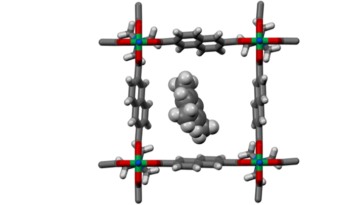

# `host_guest`

<!--  -->
<div align="center">
    
</div>

## Overview

`host_guest` is a Python module for generating complexes between a host system and a guest molecule. This module facilitates the process by automating the placement of guest molecules within a specified radius around the host system and calculating the binding energies using the GFN-xTB method.

## Features

- **Automated Host-Guest Configuration**:
  The module accepts a host system and guest molecules as input and automatically places a series of guest molecules at random positions within a radius around the host. One or more host or guest molecules can be inserted for each configuration.

- **Energy Calculation**:
  For each generated host-guest configuration, the module computes the single-point energy using the GFN-xTB method.

- **Data Output**:
  All computed binding energies and the corresponding host-guest configurations are saved in JSON files consequently providing an organized and accessible format for further analysis.

## Installation

The intsallation of host_guest requires mamba or conda environment.This is because `xtb` requires `conda-forges` which makes it work on all platforms.

## Conda Installation

This document provides a step-by-step guide for installing the `host_guest` project using Conda. Follow the instructions below to set up your environment.

## Prerequisites

Before you begin, ensure that you have the following installed on your system:

- **Conda**: You can install Anaconda or Miniconda, which provides the Conda package manager.
- **Git**: Make sure Git is installed to clone the repository.

## Installation Steps

1. **Clone the Repository**

Use the following command to clone the `host_guest` repository from GitHub:

```bash
git clone https://github.com/bafgreat/host_guest.git
cd host_guest
conda env create -f  conda-env.yml
```

The above line of code will create a new conda environment called
host_guest and will also install every dependencies.

After installation activate your environment as follows:

```bash
conda activate host_guest
```

```bash
pip install .
```

## Usage

## **Loading system**

So far all ase readable files, qchem, AMS, Gaussian input and output files can be loaded directly.

```Python
from host_guest.io import coords_library
mof  = coords_library.load_data_as_ase('test_data/EDUSIF.cif')
molecule = coords_library.load_data_as_ase('test_data/biphenyl.xyz')
```

## **Computing maximum molecule diameter**

You can compute the maximum diameter of your molecule to verify whether the whether it can fit inside a pore

```Python
from host_guest.io import coords_library,filetyper
from host_guest.geometry import pore_analyser
molecule = coords_library.load_data_as_ase('test_data/biphenyl.xyz')
mole_max_diameter = pore_analyser.molecule_diameter(molecule)
```

## **Maximum diameter of pore**

Compute the diameter of a porous system

```Python
from host_guest.io import coords_library,filetyper
from host_guest.geometry import pore_analyser
mof  = coords_library.load_data_as_ase('test_data/EDUSIF.cif')
mof_max_diameter = pore_analyser.pore_diameter_of_structure(mof)
```

## **Binding energy**

There are several ways to create complexes and compute their binding energies.

### Generate complex and binding energy directly from two files

The most simple way is to

```Python
from host_guest.io import coords_library, filetyper
from host_guest.energy import docker

mof  = coords_library.load_data_as_ase(path_to_host_file)
molecule = coords_library.load_data_as_ase(path_to_molecule_file)
energy_dict, complex_molecules = docker.Dock(mof, molecule, number_of_host=1, number_of_monomers=1, number_of_complexes=2)
filetyper.append_json(energy_dict, path_to_save_energy)
filetyper.append_json_atom(complex_molecules, path_to_save_complexes)
```

#### NOTE

- path_to_host_file: is the path to the file containing the host file e.g `test_data/EDUSIF.cif`
- path_to_molecule_file: is the path to the file containing the molecule file e.g `test_data/biphenyl.xyz`
- number_of_host : Number of host system to be create in the complex. 1 mean that you will have one host and 2 means two and so on.
- number_of_monomers : Number of monomers to be created in the complex. 1 mean that you will have one monomer and 2 means two and so on.
- number_of_complexes : Number of complex to be created in the complex.
- path_to_save_energy: Path to file to save the energy. It should be a json file
- path_to_save_complexes: Path to file to save the complex the complexes. It should be a json file.

### Generating complexes and binding energies from multiple files.

In case you wish to generate complexes from multiple files. You can use the following functions:

```Python
list_of_hosts = sorted(glob.glob('selected_cifs/*cif'))
list_of_monomers = sorted(glob.glob('molecules/*xyz'))

def compute_xtb_for_complexes(list_of_hosts, list_of_monomers, results_folder, number_of_host=1, number_of_monomers=1, number_of_complexes=15):
    """
    A function to extract the energy of a given host-guest system.
    parameter
    ----------
    list_of_hosts: list
        List of host system files.
    list_of_monomers: list
        List of monomer files.
    results_folder: str
        Folder to store results.
    number_of_host: int, optional
        Number of host molecules.
    number_of_monomers: int, optional
        Number of monomer molecules.
    number_of_complexes: int, optional
        Number of complexes to generate.
    """
    seen = []
    if not os.path.exists(results_folder):
        os.makedirs(results_folder)
    all_complexes = os.path.join(results_folder, 'complexes')
    all_energy = os.path.join(results_folder, 'xtb_energy')
    if not os.path.exists(all_complexes):
        os.makedirs(all_complexes)

    if not os.path.exists(all_energy):
        os.makedirs(all_energy)

    refcodes_path = glob.glob(f'{all_energy}/*.json')


    if len(refcodes_path)>0:
        seen = [refcodes.split('/')[-1].split('.')[0] for refcodes in refcodes_path]
    print (seen)


    new_mol = {}
    new_energy = {}

    list_of_monomers = sorted([os.path.join(list_of_monomers, i) for i in os.listdir(list_of_monomers)])

    for host_system_file in list_of_hosts:
        host_base_name = os.path.basename(host_system_file).split('.')[0]
        print (host_base_name)
        if host_base_name not in seen:
            print(host_system_file)
            for monomer_file in list_of_monomers:
                monomer = read(monomer_file)
                host_system = read(host_system_file)
                monomer_base_name = os.path.basename(monomer_file).split('.')[0]
                base_name = host_base_name + '_' + monomer_base_name
                if base_name not in seen:
                    energy_dict, complex_molecules = docker.Dock(
                        host_system, monomer, number_of_host, number_of_monomers, number_of_complexes)
                    new_mol[base_name] = complex_molecules
                    new_energy[base_name] = energy_dict
                    mol_files = os.path.join(all_complexes, host_base_name+'.json')
                    energy_files = os.path.join(all_energy, host_base_name+'.json')
                    filetyper.append_json(new_energy, energy_files)
                    filetyper.append_json_atom(new_mol, mol_files)
                else:
                    print(f'{base_name} has already been computed')
        else:
            print(f'{host_base_name} has already been computed')
    return
compute_xtb_for_complexes(list_of_hosts, list_of_monomers, number_of_complexes=15)
```

## Command Line Arguments

You can also run everything directly from the command line

1; **Batch processing**

If your host systems and monomers are different folders, you can simply run the below command and it will search for `cif` and `xyz` files in each folders. Note that in such a case your host system must be in `cif` file format and your monomers must be in `xyz` file format.

```bash
dock_folder host_folder monomer_folder -nc 20
```

### Arguments

- `host_folder` (str): A folder containing host systems (files with .cif extension).
- `monomer_folder` (str): A folder containing guest systems (files with .xyz extension).
- `-nh`, --number_of_host (int, optional): The number of host systems to consider. `Default is 1`.
- `-nm`, --number_of_monomers (int, optional): The number of monomer systems to consider. `Default is 1`.
- `-nc`, --number_of_complexes (int, optional): The number of complexes to consider. `Default is 1`.
- `-r`, --results_folder (str, optional): Directory to save the output files. - Default is `results_folders`.

2; **Single file**

When your host system and monomers are in the same folders, the following command will generate 20 complexes in which complex contains one host system and one monomer.

```bash
dock_structure host_file monomer_file -nc 20
```

- `host_file` (str): Host file. Can be any ase readable file
- `monomer_file` (str): Monomer file. Can be in ASE readable format
- `-nh`, --number_of_host (int, optional): The number of host systems to consider. `Default is 1`.
- `-nm`, --number_of_monomers (int, optional): The number of monomer systems to consider. `Default is 1`.
- `-nc`, --number_of_complexes (int, optional): The number of complexes to consider. `Default is 1`.
- `-r`, --results_folder (str, optional): Directory to save the output files. - Default is `results_folders`.

## N.B Incase you wish to create complexes without computing energy

In many cases, the xtb calculation may take a long time and you just
wish to quickly generate a series of complexes without computing
their BDE. Run the following command line arguments.

1; **Single file**

```bash
    complexes_from_file host_file monomer_file
```

- `host_file` (str): Host file. Can be any ase readable file
- `monomer_file` (str): Monomer file. Can be in ASE readable format
- `-nh`, --number_of_host (int, optional): The number of host systems to consider. `Default is 1`.
- `-nm`, --number_of_monomers (int, optional): The number of monomer systems to consider. `Default is 1`.
- `-nc`, --number_of_complexes (int, optional): The number of complexes to consider. `Default is 1`.
- `-r`, --results_folder (str, optional): Directory to save the output files. - Default is `results_folders`.

2; **Batch processing**

```bash
    complexes_from_folder  host_folder monomer_folder
```

- `host_folder` (str): A folder containing host systems (files with .cif extension).
- `monomer_folder` (str): A folder containing guest systems (files with .xyz extension).
- `-nh`, --number_of_host (int, optional): The number of host systems to consider. `Default is 1`.
- `-nm`, --number_of_monomers (int, optional): The number of monomer systems to consider. `Default is 1`.
- `-nc`, --number_of_complexes (int, optional): The number of complexes to consider. `Default is 1`.
- `-r`, --results_folder (str, optional): Directory to save the output files. - Default is `results_folders`.

### json_to_cif

The output from all the above commands will be create JSON files in the
results folder containing the complexes atoms and energies. This was done
to prevent creating multiple files. However, if you wish to conver the json
file to cif files you run the following command:

```bash
json_to_cif json_file
```

#### NB

You can also run the above command on a folder containing the json file

```bash
json_to_cif json_folder
```

#### Note

The `json_to_cif` command will create folder with a default name `Complex_cif_folders`. You can specify a different name by simply passing
it to the `json_to_cif` command as follows:

```bash
json_to_cif json_folder -r my_cif_folder_name
```

## **Compute xtb energy**

Now you can directly compute the xtb energy directly from a file or folder containing structure files. The energy is directly extracted and converted
to kcal/mol. You can acheive this as follows:

```bash
compute_xtb  filename or folder
```

## License

This project is licensed under the MIT License.

## Contributing

Contributions are welcome! Please fork the repository and submit a pull request with your changes.

## Support

For any issues or questions, please open an issue on the GitHub repository.
